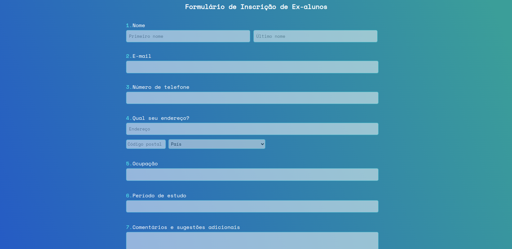

<h1 align="center"> FORM EX ALUNOS </h1>

  

 

### 🚀 Tecnologias

Desenvolvido com:

- HTML e CSS
- JavaScript

### 💻 Projeto

Formulário para cadastro de ex-alunos. Com validações e tratamento de erros.

### 🖱️ Visite

https://jonathafernandes.github.io/form-ex-alunos/